# Interpretability of Neural Networks

## Project overview

Pytorch implementation of various neural network interpretability methods and how they can interpret uncertainty awareness models. 

The main implementation can be found in the `nn_interpretability` package. We also provide every method an accompanied Jupyter Notebook to demonstrate how we can use the `nn_interpretability` package in practice. Some of the methods are showcased together in one notebook for better comparison. Next to the interpretability functionality, we have defined a repository for models we trained and additional functionality for loading and visualizing data and the results from the interpretability methods. Furthermore, we have implemented uncertainty techniques to observe the behavior of interpretability methods under stochastical settings.

<table  border=0 width="50px" >
  <tbody>
    <tr>
        <td width="25%" align="center"><strong>Activation Maximization</strong></td>
        <td width="25%" align="center"><strong>AM in codespace (GAN)</strong></td>
        <td width="25%" align="center"><strong>AM in codespace (DCGAN)</strong></td>
        <td width="25%" align="center"><strong>DeConvNet</strong></td>
   </tr>
    <tr>
        <td width="25%" align="center">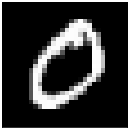</td>
        <td width="25%" align="center">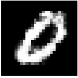</td>
        <td width="25%" align="center">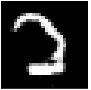</td>   
        <td width="25%" align="center">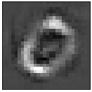</td>
   </tr>
    <tr>
        <td width="25%" align="center"><strong>Vallina Backpropagation</strong></td>
        <td width="25%" align="center"><strong>Guided Backpropagation</strong></td>
        <td width="25%" align="center"><strong>Integrated Gradients</strong></td>
        <td width="25%" align="center"><strong>SmoothGrad</strong></td>
   </tr>
    <tr>
        <td width="25%" align="center">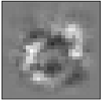</td>
        <td width="25%" align="center">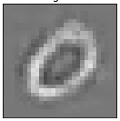</td>
        <td width="25%" align="center"></td>   
        <td width="25%" align="center">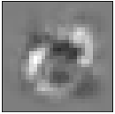</td>
   </tr>
  </tbody>
    <tr>
        <td width="25%" align="center"><strong>Simple Taylor Decomposition</strong></td>
        <td width="25%" align="center"><strong>Deep Taylor Decomposition</strong></td>
        <td width="25%" align="center"><strong>LRP-0</strong></td>
        <td width="25%" align="center"><strong>LRP-ε</strong></td>
   </tr>
    <tr>
        <td width="25%" align="center">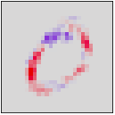</td>
        <td width="25%" align="center">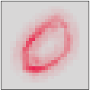</td>
        <td width="25%" align="center">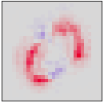</td>   
        <td width="25%" align="center">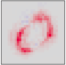</td>
   </tr>
  </tbody>
    <tr>
        <td width="25%" align="center"><strong>DeepLIFT Rescale</strong></td>
        <td width="25%" align="center"><strong>DeepLIFT RevealCancel</strong></td>
        <td width="25%" align="center"><strong>CAM</strong></td>
        <td width="25%" align="center"><strong>Grad-CAM</strong></td>
   </tr>
    <tr>
        <td width="25%" align="center">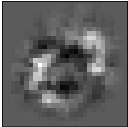</td>
        <td width="25%" align="center">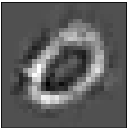</td>
        <td width="25%" align="center"></td>   
        <td width="25%" align="center">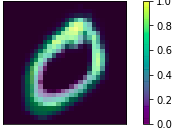</td>
   </tr>
  </tbody>
</table>

### DeepDream
<table  border=0 width="50px" >
  <tbody>
    <tr>
        <td width="33%" align="center">Original Image</td>
        <td width="33%" align="center">VGG19 Layer:25</td>
        <td width="33%" align="center">VGG19 Layer:25 Filter: 150</td>
   </tr>
    <tr>
        <td width="33%" align="center"></td>
        <td width="33%" align="center">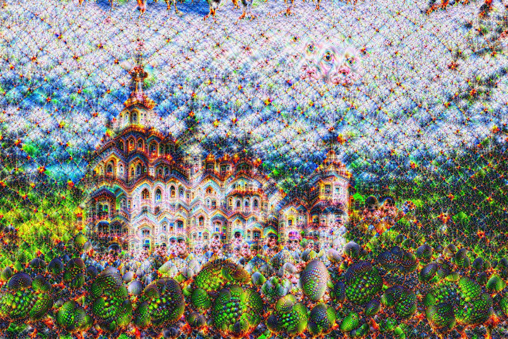</td>
        <td width="33%" align="center">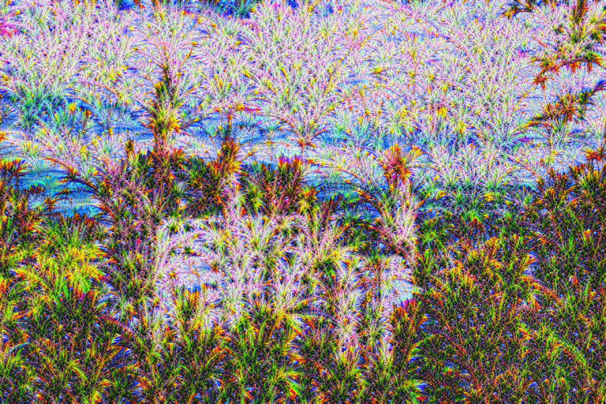</td>   
   </tr>
  </tbody>
</table>

## Setup
The main deliverable of this repository is the package `nn_interpretability`, which entails every implementation of a NN interpretability method that we have done as part of the course. It can be installed and used as a library in any project. In order to install it one should clone this repository and execute the following command:
```
pip install -e .
```
After that, the package can be used anywhere by importing it:
```
import nn_interpretability as nni
```
An example usage of a particular interpretability method can be found in the corresponding Jupyter Notebook as outlined below. We also prepared a general demonstration of the developed package in this [Jupyter Notebook.](./14.Demo.ipynb)

<table  border=0 width="50px" >
  <tbody>
    <tr>
        <td width="30%" align="center">Image classified as tandem bicycle by pretrained VGG16</td>
        <td width="70%" align="center">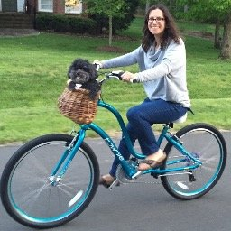</td>
   </tr>
    <tr>
        <td width="30%" align="center">LRP Composite</td>
        <td width="70%" align="center">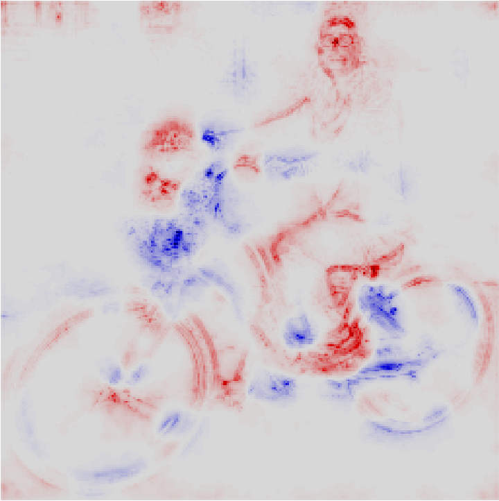</td>
   </tr>
    <tr>
        <td width="30%" align="center">Guided Backpropagation</td>
        <td width="70%" align="center">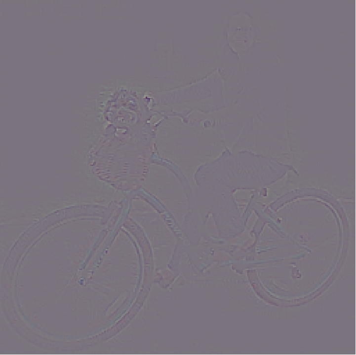</td>
   </tr>
    <tr>
        <td width="30%" align="center">DeepLIFT RevealCancel</td>
        <td width="70%" align="center">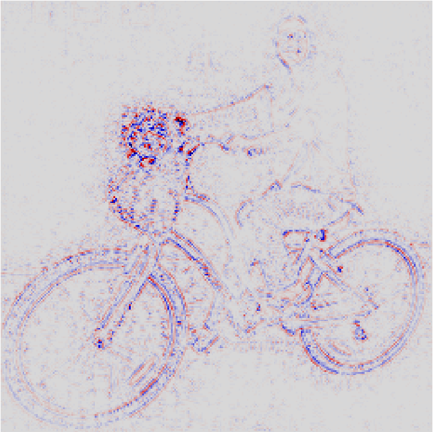</td>
   </tr>
  </tbody>
</table>

**Note:** The package assume that layers of the model are constructed inside containers(e.g. features and classifier). This setting is due to the structure of the pretrained models from the model zoo. You could use `torch.nn.Sequential` or `torch.nn.ModuleList` to achieve this on your own model.

## Interpretability methods
### 1. Model-based approaches
 - Activation Maximization
   - [General Activation Maximization](./1.Activation_Maximization.ipynb) [1]
   - [Activation Maximization in Codespace (GAN)](./1.Activation_Maximization.ipynb) [1]
   - [Activation Maximization in Codespace (DCGAN)](./1.Activation_Maximization.ipynb) [1]
 - [DeepDream](./2.Deep_Dream.ipynb) [2][13]

### 2. Decision-based approaches
 - [Saliency Map](./3.Saliency_Maps.ipynb) [4]
 - DeConvNet
   - [Full Input Reconstruction](./4.Deconvolution.ipynb) [5]
   - [Partial Input Reconstruction](./4.Deconvolution.ipynb) [5]
 - [Occlusion Sensitivity](./5.Occlusion_Sensitivity.ipynb) [5]
 - Backpropagation
   - [Vallina Backpropagation](./6.Backpropagation.ipynb) [4]
   - [Guided Backpropagation](./6.Backpropagation.ipynb) [6]
   - [Integrated Gradients](./6.Backpropagation.ipynb) [7]
   - [SmoothGrad](./6.Backpropagation.ipynb) [9]
 - Taylor Decomposition
   - [Simple Taylor Decomposition](./7.Taylor_Decomposition.ipynb) [1]
   - [Deep Taylor Decomposition](./7.Taylor_Decomposition.ipynb) [1][8]
 - LRP
   - [LRP-0](./8.1.LRP.ipynb) [8]
   - [LRP-epsilon](./8.1.LRP.ipynb) [8]
   - [LRP-gamma](./8.1.LRP.ipynb) [8]
   - [LRP-ab](./8.1.LRP.ipynb) [1][8]
 - DeepLIFT
   - [DeepLIFT Rescale](./9.DeepLIFT.ipynb) [12]
   - [DeepLIFT Linear](./9.DeepLIFT.ipynb) [12]
   - [DeepLIFT RevealCancel](./9.DeepLIFT.ipynb) [12]
 - CAM
   - [Class Activation Map (CAM)](./10.1.Class_Activation_Map.ipynb) [10]
   - [Gradient-Weighted Class Activation Map (Grad-CAM)](./10.2.Grad_Class_Activation_Map.ipynb) [11]

### 3. Uncertainty
 - Monte Carlo Dropout 
   - [Monte Carlo Dropout Analysis](./11.MC_Dropout_Interpretability.ipynb) [14]
   - [Uncertainty interpretability with LRP](./11.MC_Dropout_Interpretability.ipynb)
 - Evidential Deep Learning
   - [Evidential Deep Learning Anaylsis](./12.Evidential_Interpretability.ipynb) [15]
   - [Base Model vs. Evidential Deep Learning Model with LRP](./12.Evidential_Interpretability.ipynb)
 - Uncertain DeepLIFT
   - [DeepLIFT Deterministic vs. Stochastic Model](./13.Uncertainty_Aware_DeepLIFT.ipynb)
   - [DeepLIFT Random Noise](./13.Uncertainty_Aware_DeepLIFT.ipynb)
   - [Temperature scaling](./13.Uncertainty_Aware_DeepLIFT.ipynb) [16]

## References
[1] Montavon, Grégoire and Samek, Wojciech and Müller, Klaus-Robert. Methods for interpreting and understanding deep neural networks. Digital Signal Processing, 73:1–15, Feb 2018. | [Paper](https://arxiv.org/abs/1706.07979)  

[2] Chris Olah, Alexander Mordvintsev, and Ludwig Schubert. Feature visualization.Distill, 2017. | [Paper](https://distill.pub/2017/feature-visualization/)  

[3] Chris Olah et al. The Building Blocks of Interpretability.Distill, 2017. | [Paper](https://distill.pub/2018/building-blocks/)  

[4] Karen Simonyan, Andrea Vedaldi, and Andrew Zisserman. Deep inside convolutional networks:Visualising image classification models and saliency maps, 2013. | [Paper](https://arxiv.org/pdf/1312.6034.pdf)  

[5] Matthew D Zeiler and Rob Fergus. Visualizing and understanding convolutional networks, 2013. | [Paper](https://arxiv.org/pdf/1311.2901.pdf)  

[6] Jost Springenberg, Alexey Dosovitskiy, Thomas Brox, and Martin Riedmiller. Striving for sim-plicity: The all convolutional net. 12 2014. | [Paper](https://arxiv.org/pdf/1412.6806.pdf)  

[7] Mukund Sundararajan, Ankur Taly, and Qiqi Yan. Axiomatic attribution for deep networks.CoRR, abs/1703.01365, 2017. | [Paper](https://arxiv.org/pdf/1703.01365.pdf)   

[8] Grégoire Montavon, Alexander Binder, Sebastian Lapuschkin, Wojciech Samek, and Klaus-Robert Müller.Layer-Wise Relevance Propagation:  An Overview, pages 193–209. 09 2019. | [Paper](http://iphome.hhi.de/samek/pdf/MonXAI19.pdf)    

[9] Daniel Smilkov, Nikhil Thorat, Been Kim, Fernanda B. Viégas, and Martin Wattenberg. Smooth-grad:  removing noise by adding noise.CoRR, abs/1706.03825, 2017 | [Paper](https://arxiv.org/pdf/1706.03825.pdf)   

[10] B. Zhou, A. Khosla, Lapedriza. A., A. Oliva, and A. Torralba. Learning  Deep  Features  forDiscriminative Localization.CVPR, 2016. | [Paper](http://cnnlocalization.csail.mit.edu/Zhou_Learning_Deep_Features_CVPR_2016_paper.pdf)  

[11]  Ramprasaath R. Selvaraju, Abhishek Das, Ramakrishna Vedantam, Michael Cogswell, DeviParikh, and Dhruv Batra. Grad-cam: Why did you say that? visual  explanations from deepnetworks via gradient-based localization.CoRR, abs/1610.02391, 2016. | [Paper](https://arxiv.org/pdf/1610.02391.pdf)  

[12] Avanti Shrikumar, Peyton Greenside, and Anshul Kundaje. Learning important features throughpropagating activation differences, 2017. | [Paper](https://arxiv.org/pdf/1704.02685.pdf)   

[13] Alexander Mordvintsev, Christopher Olah, and Mike Tyka. Inceptionism: Going deeper intoneural networks, 2015. | [Paper](https://ai.googleblog.com/2015/06/inceptionism-going-deeper-into-neural.html)  

[14] Yarin Gal and Zoubin Ghahramani. Dropout as a bayesian approximation: Representing modeluncertainty in deep learning, 2015. | [Paper](https://arxiv.org/pdf/1506.02142.pdf)  

[15] Murat Sensoy, Lance Kaplan, and Melih Kandemir.  Evidential deep learning to quantify classifi-cation uncertainty, 2018. | [Paper](https://arxiv.org/pdf/1806.01768.pdf)  

[16] Chuan Guo, Geoff Pleiss, Yu Sun, and Kilian Q. Weinberger. On calibration of modern neuralnetworks, 2017.
 | [Paper](http://proceedings.mlr.press/v70/guo17a/guo17a.pdf)  
